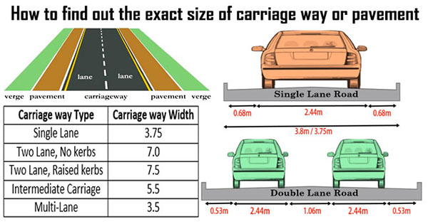
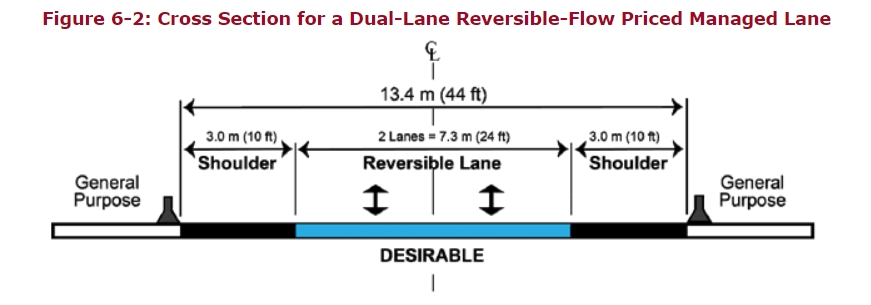

# Deník
**Author: Daria Volodenko**

-----
## Model auta
ARCADE: FREE Racing Car
[https://assetstore.unity.com/packages/3d/vehicles/land/arcade-free-racing-car-161085](https://assetstore.unity.com/packages/3d/vehicles/land/arcade-free-racing-car-161085) 

Poznámky autora modelu:
* This is a racing car inspired by american designs which you can use for personal/commercial projects.

Prototyp auta v reálném světě: 
[https://en.wikipedia.org/wiki/Bentley_Continental_GT](https://en.wikipedia.org/wiki/Bentley_Continental_GT)

**2018 Bentley Continental GT** 
Informace: [https://www.encycarpedia.com/bentley/18-continental-gt-coupe](https://www.encycarpedia.com/bentley/18-continental-gt-coupe)
* Wheelbase	2,851 mm
* Turning Circle 11,5 m
* Rear Track 1,664 mm

-----
## Silnice
[https://www.civildailyinfo.com/engineering/how-to-find-out-the-exact-size-of-carriage-way-or-pavement.html](https://www.civildailyinfo.com/engineering/how-to-find-out-the-exact-size-of-carriage-way-or-pavement.html)

[https://ops.fhwa.dot.gov/publications/fhwahop13007/pmlg6_0.htm](https://ops.fhwa.dot.gov/publications/fhwahop13007/pmlg6_0.htm)

Takže udělám obrazek 2.

-----
Ackermann steering geometry:
[https://ru.wikipedia.org/wiki/%D0%A0%D1%83%D0%BB%D0%B5%D0%B2%D0%B0%D1%8F_%D1%82%D1%80%D0%B0%D0%BF%D0%B5%D1%86%D0%B8%D1%8F_%D0%90%D0%BA%D0%BA%D0%B5%D1%80%D0%BC%D0%B0%D0%BD%D0%B0](https://ru.wikipedia.org/wiki/%D0%A0%D1%83%D0%BB%D0%B5%D0%B2%D0%B0%D1%8F_%D1%82%D1%80%D0%B0%D0%BF%D0%B5%D1%86%D0%B8%D1%8F_%D0%90%D0%BA%D0%BA%D0%B5%D1%80%D0%BC%D0%B0%D0%BD%D0%B0)

[https://www.quora.com/What-is-the-formula-for-the-Ackermann-percentage](https://www.quora.com/What-is-the-formula-for-the-Ackermann-percentage)